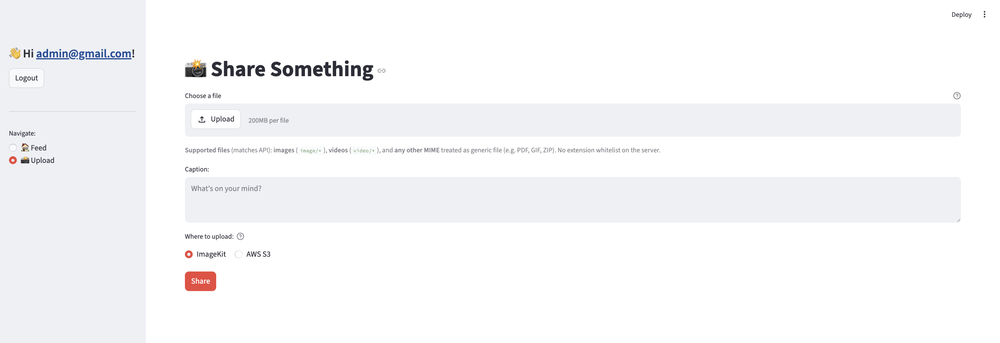
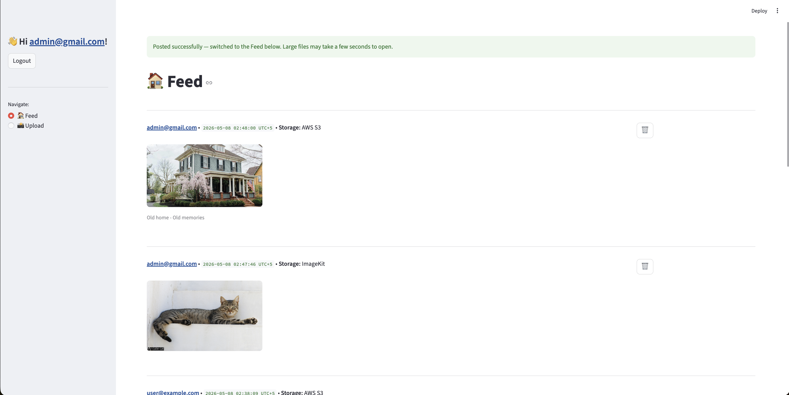

# 📸 Simple Social

[ 🇬🇧 English ](README.md) | [ 🇰🇿 Қазақша ](docs/README_KK.md) | [ 🇷🇺 Русский ](docs/README_RU.md)


A lightweight social-style app: **FastAPI** REST API plus a **Streamlit** web UI. Users register, upload media, and browse a feed.

> **Dual object storage:** the backend and UI **both support ImageKit *and* AWS S3.** Each upload selects one target (**ImageKit** for CDN + server-side transforms, **S3** for your own bucket via `boto3`). ImageKit URLs can use transformation chains in the feed; raw S3 URLs are shown unchanged.

## 🚀 Features

- **Authentication:** Registration & login via JWT (`fastapi-users`).
- **Media uploads:** Images, videos, and generic files (PDF, HTML, …) per backend MIME classification.
- **Dual storage (required product feature):** every share can go to **ImageKit** *or* **AWS S3** — configure both in `.env`, pick in the UI before **Share**.
- **Feed:** Sorted posts with owner-aware delete; each card shows **Storage: ImageKit** or **Storage: AWS S3**.
- **ImageKit-only UI transforms:** Caption overlays (URL-based) apply only when `storage=imagekit`.

## 📷 Screenshots

| Upload (storage picker) | Feed (posts + storage labels) |
|:--:|:--:|
|  |  |

## ⚙️ Setup

1. Clone the repo and `cd` into the project root.
2. Install dependencies:
   ```bash
   uv sync
   ```
3. Create `.env` file based on `.env.example`.

## 🏃 How to run

Use **two terminals** (backend + frontend).

**Backend —** `http://localhost:8000` (Swagger: `/docs`)

```bash
uv run uvicorn app.main:app --reload
```

**Frontend —** `http://localhost:8501`

```bash
uv run streamlit run frontend/app.py
```

Run Streamlit from the **repo root** so imports and paths match; optional `frontend/.streamlit/config.toml` controls upload size hints.

## 📁 Project layout

```text
.
├── app/                 # FastAPI app
│   ├── main.py
│   ├── lifespan.py
│   ├── db.py
│   ├── dependencies.py
│   ├── models/
│   ├── routers/         # auth, users, posts
│   ├── schemas/
│   ├── services/
│   ├── images.py        # ImageKit client
│   ├── s3_storage.py    # S3 uploads / deletes
│   └── users.py         # FastAPI Users wiring
├── docs/                # Localized READMEs + screenshots
│   ├── README_KK.md
│   ├── README_RU.md
│   └── images/          # UI screenshots for documentation
├── frontend/
│   ├── app.py           # Streamlit UI
│   └── .streamlit/
├── pyproject.toml
├── uv.lock
└── .env                 # local secrets
```
